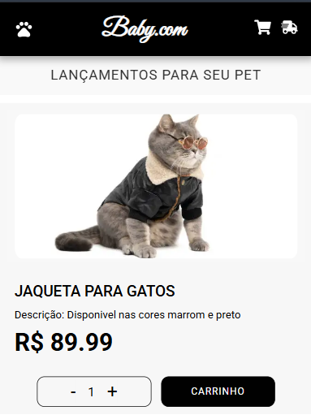

# Projeto Site de Roupas Pet
 Site ficticio de venda de roupas para pets.
 

 # Descrição
Este projeto simula uma loja virtual de venda de roupas para pets, permitindo aos usuários adicionar produtos ao carrinho com a quantidade desejada.

 # Funcionalidades 
* Escolher a quantidade
* Adicionar ao Carrinho

# Tecnologias Utilizadas
* Html
* CSS
* JavaScript
* React + Vite
* Biblioteca React Icons

# Futuras Implementações
* Integração a uma API de pagamento
* Criação de uma página de login para usuários
* Implementação da funcionalidade de salvar itens no carrinho.

# Como Executar o Projeto
 1. Clone o repositório.

 git clone https://github.com/seu-usuario/nome-do-repositorio.git

 2. Instale as dependências:

 npm install

 3. Execute o projeto:

 npm run dev

 4. Acesse no navegador:

 Http://localhost:

